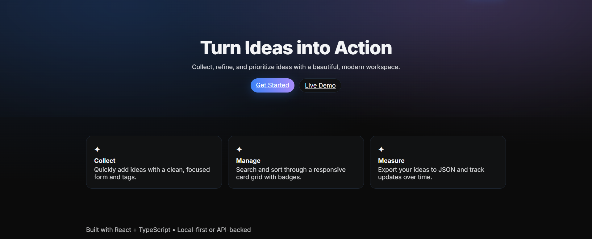

# 💡 Idea Bank – Modern & Aesthetic Idea Management App

Welcome to **Idea Bank**, your personal, beautifully designed space for capturing, organizing, and tracking every spark of creativity.



---

## ✨ Features

* **Card-Based Layout** – Elegant, responsive cards with smooth hover animations and gradient accents.
* **Add, Edit, Delete Ideas** – Manage your ideas with an intuitive, glassy modal interface.
* **Search & Filter** – Quickly find ideas by name or keyword.
* **Feasibility & Market Potential Badges** – Color-coded tags for instant prioritization.
* **Local Persistence** – Ideas are saved automatically in your browser via `localStorage`.
* **Export to JSON** – Backup or share your idea bank in one click.
* **Dark Mode** – Sleek deep tones with glowing highlights.

---

## 🎨 Design Philosophy

Inspired by **Apple Vision Pro** and **Notion**, Idea Bank combines:

* **Glassmorphism** for modals and navigation.
* **Gradient glow borders** on hover.
* **Soft shadows & rounded corners** for depth.
* **Subtle micro-animations** to make the experience feel alive.

---

## 🛠 Tech Stack

* **React + TypeScript** – Modern, type-safe frontend.
* **Tailwind CSS** – Utility-first, responsive design.
* **Framer Motion** – Smooth, elegant animations.
* **LocalStorage API** – Offline-friendly data persistence.

---

## 🚀 Getting Started

```bash
# Clone the repository
git clone https://github.com/sukanyaghosh74/idea-bank.git
cd idea-bank

# Install dependencies
npm install

# Start development server
npm run dev
```

Visit `http://localhost:5173` to see your Idea Bank in action.

---

## 📂 Project Structure

```
src/
  components/   # Reusable UI components
  pages/        # Page layouts
  utils/        # Helper functions (storage, formatting)
  App.tsx       # Main app entry
```

---

## 💡 Future Plans

* 🔄 Cloud sync
* 📱 Mobile app version
* 📊 Idea analytics dashboard

---

## 📜 License

This project is licensed under the MIT License, feel free to use and adapt.

---

> **"Ideas are the seeds of innovation, keep them safe, nurture them, and watch them grow."** 🌱
